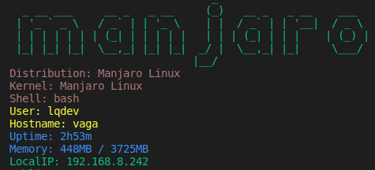
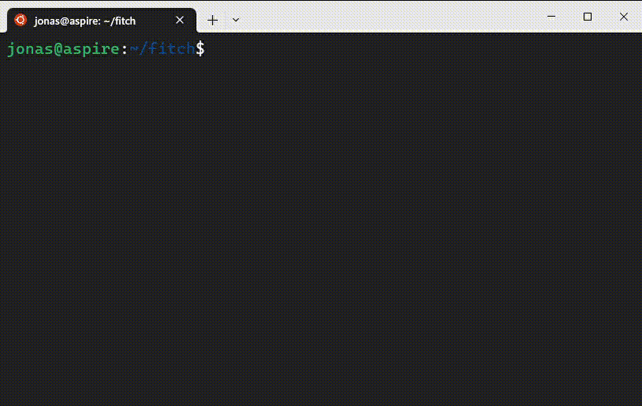

# Fitch

Command line system information display utility for Linux systems built with .NET (F#).



[.svg)](https://shields.io/)

**NOTE: This application should work on most Linux systems. However, it's only been tested on the following distributions:**

- Arch
  - Manjaro
- Debian
  - Ubuntu
- NixOS. For additional guidance, see this [article](https://www.luisquintanilla.me/wiki/nixos-dotnet-packages-source).

## Dependencies

- [Spectre.Console](https://spectreconsole.net/)

## Installation

### Prerequisites

- [.NET 8 SDK](https://dotnet.microsoft.com/download/dotnet/8.0)

### Install from [nuget](https://www.nuget.org/packages/fitch)

#### Instructions

Installation is as easy as:

```bash
dotnet tool install --global fitch
```

### Build from source

#### Instructions

1. Clone [fitch repo](http://www.luisquintanilla.me/github/fitch) in your Linux machine

    ```
    git clone https://github.com/lqdev/fitch.git && cd fitch
    ```

1. Add these lines inside `<PropertyGroup>` in the fitch.fsproj file

    ```xml
    <PublishSingleFile>true</PublishSingleFile>    
    <IncludeNativeLibrariesForSelfExtract>true</IncludeNativeLibrariesForSelfExtract>
    <RuntimeIdentifier>linux-x64</RuntimeIdentifier>
    ```

    This will generate a single executable file with all the dependencies included, a single executable file it's not supported in Nuget yet, so we need to do this manually.

1. Run the script Setup.sh

    ```bash
    ./Setup.sh
    ```

    

    Running this script will generate an executable called `fitch` in the *bin/Release/net8.0/linux-x64/publish* directory and copy it to the */usr/bin/* directory, so you can run the application from anywhere in your system.


## Run application

1. For both cases just type `fitch` in your terminal

    ```bash
    fitch
    ```

1. (Optional) Add the `fitch` command to your shell config file to start when your shell starts

## To-Dos

- [ ] Enable customization through config file

## Acknowledgements

This project was inspired by [Nitch](https://github.com/unxsh/nitch), [Neofetch](https://github.com/dylanaraps/neofetch) and made with [WSL](https://learn.microsoft.com/en-us/windows/wsl/) 🐧